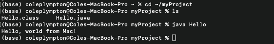
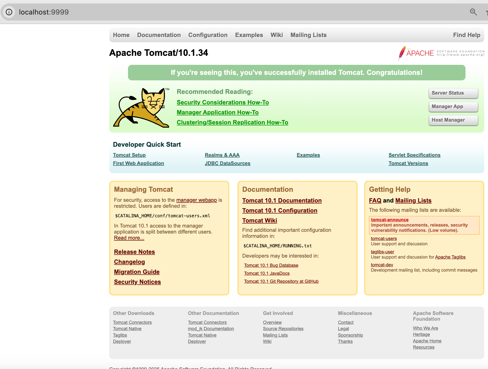

# LIS4368 - Advanced Web Applications Development

## Cole Plympton

### Assignment 1 Requirements:

*Three Parts:*

1. Distributed Version Control with Git and Bitbucket
2. Java/JSP/Servlet Development Initialization
3. Chapter Questions (Ch. 1-4)

#### README.md file should include the following items:

* Screenshot of java Hello
* Screenshot of running http://localhost:8080 (Part 2, Step #4(a) in the tutorial).
* git commands with short descriptions
* Screenshot of a1/index.jsp

#### Git commands w/short descriptions:

- `git init` - Creates a new Git repository
- `git status` - Displays the state of the working directory and the staging area
- `git add` - Adds a change in the working directory to the staging area
- `git commit` - Captures a snapshot of the project's currently staged changes
- `git push` - Uploads local repository content to a remote repository
- `git pull` - Fetches and downloads content from a remote repository and immediately updates the local repository to match that content

#### Assignment Screenshots:

#### Screenshot of java Hello:

#### Screenshot of http://localhost:9999:

#### Screenshot of a1/index.jsp:

