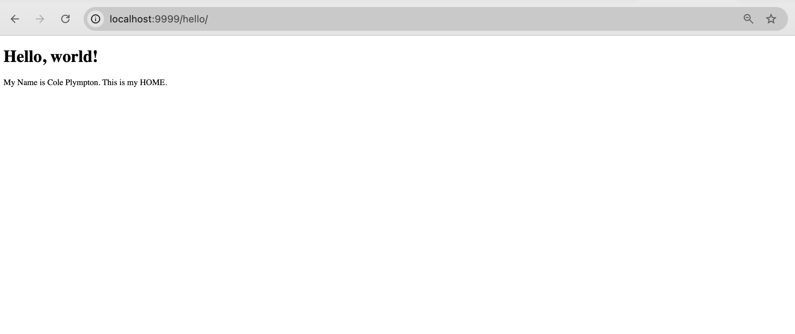

# LIS4368 - Advanced Web Applications Development

## Cole Plympton

### Assignment 2 Requirements:

*Three Parts:*

1. Distributed Version Control with Git and Bitbucket
2. Java/JSP/Servlet Development Initialization
3. Chapter Questions (Ch. 1-4)

#### README.md file should include the following items:

* Screenshot of java Hello
* Screenshot of running http://localhost:8080 (Part 2, Step #4(a) in the tutorial).
* git commands with short descriptions
* Screenshot of a1/index.jsp

#### Assignment Screenshots:

#### Screenshot of java Hello:

#### Screenshot of http://localhost:9999:

#### Screenshot of a2/index.jsp:

