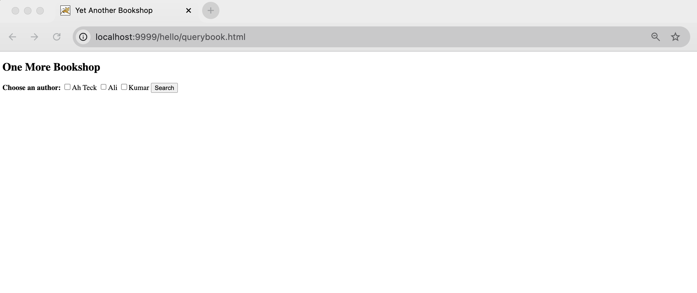
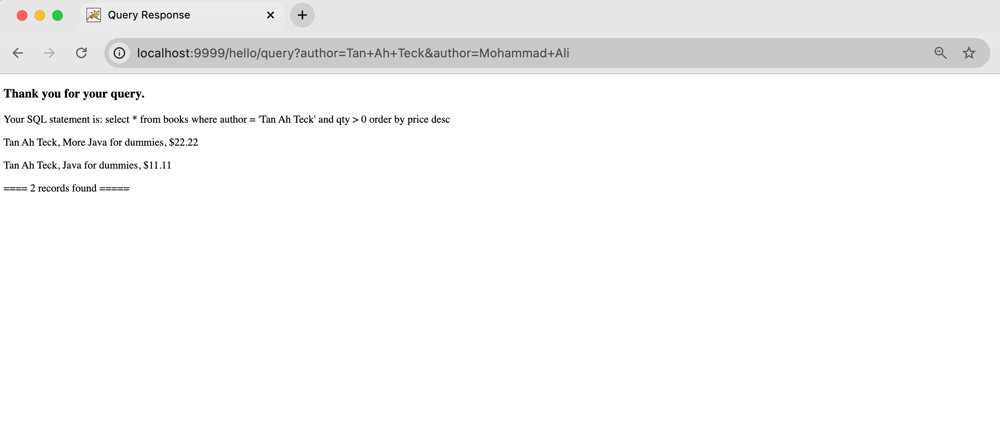
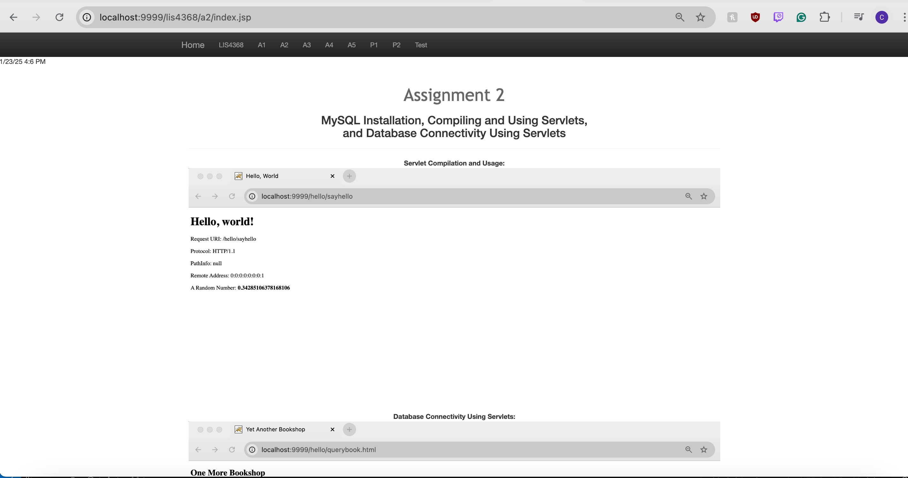

# LIS4368 - Advanced Web Applications Development

## Cole Plympton

### Assignment 2 Requirements:

*Three Parts:*

1. Write a "Hello-World" Java Servlet
2. Compile the Servlet
3. Write a Database Servlet 
4. Write the Server-side Database Query Servlet

#### README.md file should include the following items:

* Assesment Links 
* Screenshot of querybook.html
* Screenshot of query results
* Screenshot of a2/index.jsp

#### Assesment Links:

1. http://localhost:9999/hello 
2. http://localhost:9999/hello/HelloHome.html
3. http://localhost:9999/hello/sayhello (invokes HelloServlet)
4. http://localhost:9999/hello/querybook.html

#### Assignment Screenshots:

#### Screenshot of querybook.html:

#### Screenshot of Query Results:

#### Screenshot of a2/index.jsp:

