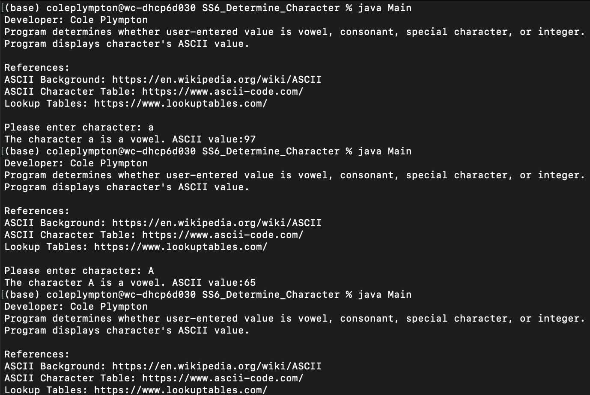

# LIS4368 - Advanced Web Applications Development

## Cole Plympton

### Assignment 3 Requirements:

*Two Parts:*

1. Create tables and include data (minimum 10 records per table)
2. Forward-engineer the database locally

#### README.md file should include the following items:

* Assignment Links 
* Screenshot of ERD
* Screenshots of 10 records for each table—use `SELECT * FROM table_name;`
* Screenshot of `a3/index.jsp`
* Links to the following files:
  * `a3.mwb`
  * `a3.sql`

#### Assignment Screenshots and Links:

#### *Screenshot A3 ERD:*

#### *A3 docs: a3.mwb and a3.sql:*
[A3 MWB File](docs/a3.mwb "A3 ERD in .mwb format")  
[A3 SQL File](docs/a3.sql "A3 SQL Script")  

#### Screenshot of `SELECT * FROM petstore;`

#### Screenshot of `SELECT * FROM customer;`

#### Screenshot of `SELECT * FROM pet;`

#### Screenshot of `a3/index.jsp:`

| Image | Description |
|-------|-------------|
|  | [Skillset 1 System Properties](../skillsets/SS4_Directory_Info/) |
|  | [Skillset 2 Looping Structures](../skillsets/SS5_Character_Info/) |
|      | [Skillset 3 Number Swap](../skillsets/SS6_Determine_Character/) |