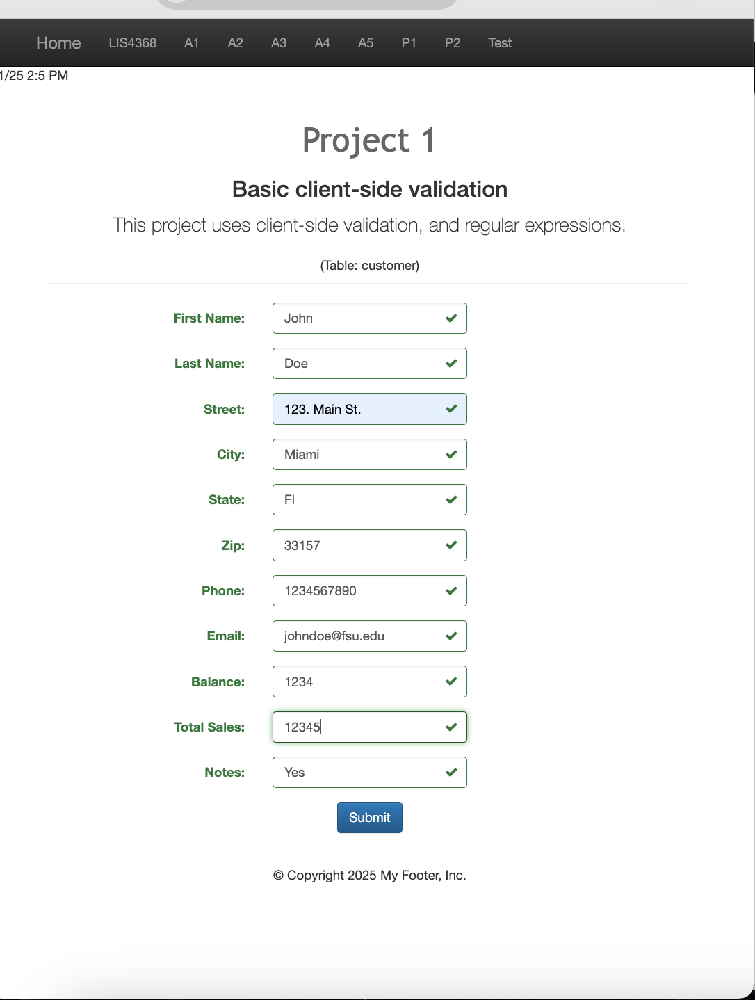

# LIS4368 - Advanced Web Applications Development

## Cole Plympton

### Project 1 Requirements:

*Two Parts:*

1. Create a customer form with proper validation
2. Implement jQuery validation with regular expressions

#### README.md file should include the following items:

* Project Links 
* [P1 index.jsp](index.jsp "View the index.jsp file")
* Screenshot of validation (valid data)
* Screenshot of validation (invalid data)

#### Project Screenshots:

#### *Screenshot of validation (valid data):*

#### *Screenshot of validation (invalid data):*

#### *Screenshot of LIS4368 Portal Page:*

| Image | Description |
|-------|-------------|
|  | Skillset 7 - Coming Soon |
|  | Skillset 8 - Coming Soon |
|  | Skillset 9 - Coming Soon |